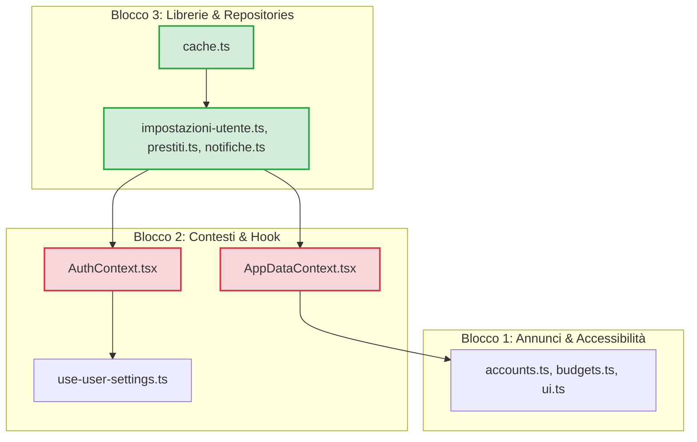

# REPORT — Analisi Completa Copertura Test
## Versione: 1.0.0
## Data: 28 Giugno 2026
## Stato: ANALISI COMPLETATA
## Autore: Antigravity — SESSIONE D

---

## Riepilogo Esecutivo

Questo report analizza i gap di copertura dei test su 39 moduli critici di ZecchinoReact, suddivisi nei tre blocchi architetturali (Annunci e Accessibilità, Contesti e Hook, Repository e Librerie).
Mancano in totale **324 test** per raggiungere l'obiettivo del 100% di copertura del codice.
I 3 moduli più critici da testare con assoluta priorità sono:
1. `src/context/AppDataContext.tsx` (state machine, hydration asincrona, azioni di mutazione e logica dei dialoghi)
2. `src/context/AuthContext.tsx` (gestione ciclo di vita sessione, PIN di sicurezza crittografici, inattività)
3. `src/lib/supabase/cache.ts` (meccanismo asincrono fondamentale per il funzionamento offline)

Sono stati identificati **7 potenziali bug**, di cui uno **CRITICO** relativo alla perdita totale delle simulazioni locali dei prestiti ad ogni bootstrap eseguito in modalità online (connesso), e uno **ALTO** che rischia di mandare in crash l'applicazione in caso di mancato allineamento delle stringhe di traduzione. Questi problemi richiedono attenzione e correzione immediata prima o in concomitanza con la scrittura dei test.

---

## Potenziali Bug Identificati

Durante l'analisi del codice sorgente sono stati identificati i seguenti comportamenti ambigui o rischiosi:

### BUG-1: Perdita delle simulazioni locali all'avvio online (bootstrap)
* **File:** [AppDataContext.tsx](file:///c:/Sviluppo/ZecchinoReact/src/context/AppDataContext.tsx#L421-L458)
* **Riga approssimativa:** 421-458 (in `loadDomainSnapshot`), e 655-675 (in `runOnlineBootstrap`)
* **Descrizione:** Le simulazioni dei prestiti sono locali e non persistite nel database remoto (hanno ID con prefisso `sim-`). L'avvio in modalità online (`runOnlineBootstrap`) recupera i dati del dominio invocando `loadDomainSnapshot()`, che interroga esclusivamente il DB remoto tramite `getAllPrestiti()`. Poiché le simulazioni non risiedono nel DB remoto, la lista ritornata ne è priva. La successiva chiamata a `applyDomainSnapshot()` sovrascrive lo stato React `prestiti`, azzerando e distruggendo tutte le simulazioni locali correntemente salvate. Subito dopo, l'effetto di persistenza rileva il cambiamento dello stato e sovrascrive la cache locale `prestiti_simulazioni` con una lista vuota.
* **Rischio:** Perdita totale e irrecuperabile di tutte le simulazioni finanziarie create dall'utente ogni volta che l'applicazione viene avviata o aggiornata in modalità connessa.
* **Priorità:** **CRITICO**
* **Azione consigliata:** Correggere `loadDomainSnapshot` o la logica di bootstrap di `AppDataContext.tsx` in modo che recuperi e mantenga le simulazioni salvate in cache locale prima di sovrascrivere lo stato con i dati scaricati dal DB.

### BUG-2: Crash di runtime su chiavi di traduzione mancanti
* **File:** [t.ts](file:///c:/Sviluppo/ZecchinoReact/src/announcements/_utils/t.ts#L11-L16)
* **Riga approssimativa:** 11-16
* **Descrizione:** La funzione di traduzione ed interpolazione `t` assume che la chiave `key` sia sempre presente nell'oggetto `strings` importato da `@/locales`. Se viene richiesta una traduzione per una chiave inesistente o mancante (ad esempio a causa di un refactoring incompleto o per una traduzione dimenticata) e vengono forniti dei parametri `params`, il codice tenterà di eseguire `.split()` su un valore `undefined` (ovvero `strings[key]`), causando un crash immediato dell'applicazione.
* **Rischio:** Crash fatali dell'applicazione durante l'elaborazione o la vocalizzazione degli annunci di accessibilità se una chiave non è registrata nel file locale di traduzione.
* **Priorità:** **ALTO**
* **Azione consigliata:** Correggere prima dei test inserendo una guardia difensiva che restituisca un fallback (es. la chiave stessa come stringa) se `strings[key]` è `undefined`: `if (!result) return String(key);`.

### BUG-3: Crash per sottoscrizione nulla all'unmount del rilevatore di accessibilità
* **File:** [detection.ts](file:///c:/Sviluppo/ZecchinoReact/src/accessibility/detection.ts#L99)
* **Riga approssimativa:** 99
* **Descrizione:** Nel cleanup del `useEffect` di sottoscrizione dello screen reader, viene chiamato `subscription.remove()` basandosi solo sul controllo `typeof subscription.remove === 'function'`. Se per qualsiasi motivo l'oggetto `subscription` restituito da `AccessibilityInfo.addEventListener` fosse `null` o `undefined` (situazione tipica su macchine di sviluppo Windows, mock incompleti o vecchie versioni del framework), l'accesso alla proprietà `.remove` causerà un TypeError bloccante.
* **Rischio:** Crash durante l'unmount dell'applicazione o del componente di rilevamento dell'accessibilità.
* **Priorità:** **MEDIO**
* **Azione consigliata:** Aggiungere una verifica di esistenza prima dell'accesso alla proprietà: `if (subscription && typeof subscription.remove === 'function')`.

### BUG-4: Crash per sottoscrizione nulla all'unmount del contesto di autenticazione
* **File:** [AuthContext.tsx](file:///c:/Sviluppo/ZecchinoReact/src/context/AuthContext.tsx#L249)
* **Riga approssimativa:** 249
* **Descrizione:** Simile al BUG-3, nel cleanup dell'effetto che ascolta lo stato dello screen reader all'interno del provider di autenticazione, viene eseguito `subscription.remove()` senza verificare preventivamente la validità dell'oggetto `subscription`.
* **Rischio:** Crash dell'applicazione all'unmount del provider principale di autenticazione.
* **Priorità:** **MEDIO**
* **Azione consigliata:** Aggiungere un controllo difensivo: `if (subscription && typeof subscription.remove === 'function')`.

### BUG-5: Parametro "hadTransactions" cablato a true in eliminazione conto
* **File:** [AppDataContext.tsx](file:///c:/Sviluppo/ZecchinoReact/src/context/AppDataContext.tsx#L1601)
* **Riga approssimativa:** 1601
* **Descrizione:** Nel metodo `handleDeleteConfirm` per la rimozione di un conto, viene chiamato `accountsAnn.announceAccountDeleted(account.nome, true)`. Il valore booleano `true` per segnalare la presenza di transazioni collegate è cablato staticamente.
* **Rischio:** Gli screen reader annunceranno sempre all'utente non vedente o ipovedente che il conto è stato eliminato "con tutti i relativi movimenti", anche se il conto era vuoto ed è stato rimosso senza eliminare alcuna transazione, portando a una percezione errata dei dati.
* **Priorità:** **MEDIO**
* **Azione consigliata:** Calcolare dinamicamente se vi erano transazioni associate al conto prima dell'eliminazione (usando ad esempio `removedTransactions.length > 0`) e passare il valore calcolato.

### BUG-6: Perdita di maiuscole nei plurali irregolari italiani
* **File:** [plurals.ts](file:///c:/Sviluppo/ZecchinoReact/src/announcements/_utils/plurals.ts#L18-L19)
* **Riga approssimativa:** 18-19
* **Descrizione:** La funzione `pluralize` converte la parola in input in minuscolo (`word.toLowerCase()`) prima di cercarla nel dizionario delle parole irregolari (`IRREGULAR`). Se la parola corrisponde (es. "Movimento" o "Conto" con l'iniziale maiuscola), la funzione restituisce direttamente la chiave minuscola registrata nel dizionario (es. "movimenti" o "conti"), perdendo la capitalizzazione iniziale dell'utente.
* **Rischio:** Incoerenze stilistiche o grammaticali negli annunci vocalizzati in cui i sostantivi capitalizzati vengono improvvisamente pronunciati o mostrati interamente in minuscolo.
* **Priorità:** **BASSO**
* **Azione consigliata:** Rilevare se la parola in ingresso iniziava con una maiuscola e applicarla anche al risultato restituito dall'oggetto `IRREGULAR`.

### BUG-7: Mancato annuncio di superamento per budget impostati a zero
* **File:** [budgets.ts](file:///c:/Sviluppo/ZecchinoReact/src/announcements/budgets.ts#L53-L55)
* **Riga approssimativa:** 53-55
* **Descrizione:** Nella funzione `announceBudgetStatus`, se il parametro `target` è pari a 0, la percentuale calcolata viene forzata a 0: `const percent = target > 0 ? ... : 0`. Di conseguenza, la logica salta i blocchi di superamento del budget (`percent >= 100`) e cade sul blocco finale, restituendo `"budget normale, speso 0%"` anche se l'utente ha registrato spese su quel budget (es. `spent > 0`).
* **Rischio:** L'applicazione fallisce nel segnalare il superamento di un budget impostato a zero, fornendo un feedback audio errato ed eccessivamente ottimistico all'utente.
* **Priorità:** **BASSO**
* **Azione consigliata:** Aggiungere un ramo dedicato per gestire `target === 0` e `spent > 0`, impostando in quel caso il superamento forzato o la percentuale a 100%.

---

## BLOCCO 1 — Annunci e Accessibilità

### accounts.ts — 0%

* **Funzioni analizzate:** `announceAccountCreated`, `announceAccountModified`, `announceAccountDeleted`, `announceAccountDeletedGeneric`, `announceTransaction`, `announceTransactionModified`, `announceTransactionDeleted`, `announceTransfer`, `announceAccountBalance`, `announceRecentTransactions`, `announceExportCSV`, `announceExport`, `announceImportComplete`, `announceExportInProgress`, `announceExportFile`, `exportError`.
* **Test già esistenti:** No.
* **Test obbligatori identificati:**
  1. `announceAccountCreated` — formatta correttamente l'annuncio con nome, tipo e importo localizzato — *Normale*
  2. `announceAccountModified` — formatta correttamente l'annuncio con il nome del conto — *Normale*
  3. `announceAccountDeleted` con `hadTransactions` pari a `true` — formatta con la stringa contenente i movimenti — *Normale*
  4. `announceAccountDeleted` con `hadTransactions` pari a `false` — formatta con la stringa di conto semplice — *Normale*
  5. `announceAccountDeletedGeneric` — restituisce l'annuncio generico di conto rimosso — *Normale*
  6. `announceTransaction` — formatta l'annuncio inserendo tipo, importo (euro) e nome conto — *Normale*
  7. `announceTransactionModified` e `announceTransactionDeleted` — restituiscono le relative stringhe costanti — *Normale*
  8. `announceTransfer` — formatta l'annuncio indicando importo, conto origine e conto destinazione — *Normale*
  9. `announceAccountBalance` — formatta l'annuncio del saldo vocale del conto — *Normale*
  10. `announceRecentTransactions` — formatta l'annuncio con il conteggio e il plurale corretto — *Normale/Limite (0, 1, n)*
  11. `announceExportCSV`, `announceExport`, `announceImportComplete` — verificano l'interpolazione del plurale corretto dei movimenti/elementi — *Normale/Limite (0, 1, n)*
  12. `announceExportInProgress` e `announceExportFile` — restituiscono gli annunci di stato di export — *Normale*
  13. `exportError` — verifica il branching assertivo su tutte le 7 ragioni di errore (`ALREADY_IN_PROGRESS`, `PERMISSION_DENIED`, `FILESYSTEM_ERROR`, `UNSUPPORTED_PLATFORM`, `INVALID_PATH`, `INSUFFICIENT_SPACE`, `UNKNOWN`) — *Errore*
* **Test opzionali identificati:**
  1. Formato dei decimali e del separatore vocale dei conti in italiano — *Normale*
  2. Comportamento con stringhe vuote per i nomi dei conti o con caratteri speciali — *Limite*
* **Stima test totali necessari:** 21
* **Stima test già presenti:** 0
* **Stima test da scrivere:** 21
* **Dipendenze da mockare:** `@/announcements/_utils/t`, `@/announcements/_utils/currency`, `@/announcements/_utils/plurals`.
* **Note tecniche:** Assicurarsi che `formatCurrencyVocal` formatti i decimali con la virgola e aggiunga "euro" finale in conformità con la sintesi vocale italiana.

### auth.ts — 0%

* **Funzioni analizzate:** `pinNotConfigured`, `pinInvalid`, `privateUnlocked`, `privateAccountLocked`, `pinSet`, `pinChanged`, `pinRemoved`, `sessionKept`.
* **Test già esistenti:** No.
* **Test obbligatori identificati:**
  1. `pinNotConfigured` — restituisce l'annuncio di PIN non configurato con priorità `assertive` — *Normale*
  2. `pinInvalid` — restituisce l'annuncio di PIN non valido con priorità `assertive` — *Normale*
  3. `privateUnlocked` e `privateAccountLocked` — restituiscono annunci di sblocco/blocco conto privato con priorità `polite` — *Normale*
  4. `pinSet`, `pinChanged`, `pinRemoved` — restituiscono gli annunci relativi al PIN — *Normale*
  5. `sessionKept` — restituisce l'annuncio di sessione mantenuta — *Normale*
* **Test opzionali identificati:**
  1. Verifica che la priorità di tutti gli annunci di errore del PIN sia forzata ad `assertive` per l'interruzione dello screen reader — *Normale*
* **Stima test totali necessari:** 10
* **Stima test già presenti:** 0
* **Stima test da scrivere:** 10
* **Dipendenze da mockare:** `@/announcements/_utils/t`.
* **Note tecniche:** Test di tipo puramente funzionale sulle stringhe restituite e sulla priorità dell'annuncio.

### budgets.ts — 0%

* **Funzioni analizzate:** `announceBudgetCreated`, `announceBudgetModified`, `announceBudgetDeleted`, `announceBudgetDeletedGeneric`, `announceBudgetStatus`, `announceSavingsGoalCreated`, `announceSavingsGoalModified`, `announceSavingsGoalDeleted`, `announceSavingsGoalDeletedGeneric`, `announceSavingsGoalProgress`, `announceCategoryCreated`.
* **Test già esistenti:** No.
* **Test obbligatori identificati:**
  1. `announceBudgetCreated` — formatta l'annuncio con nome, importo target e periodo — *Normale*
  2. `announceBudgetModified`, `announceBudgetDeleted`, `announceBudgetDeletedGeneric` — restituiscono annunci corretti — *Normale*
  3. `announceBudgetStatus` spesa >= 100% — restituisce superamento con priorità `assertive` — *Normale/Limite*
  4. `announceBudgetStatus` spesa >= 90% e < 100% — restituisce stato critico con priorità `assertive` — *Normale*
  5. `announceBudgetStatus` spesa >= 75% e < 90% — restituisce avviso con priorità `polite` — *Normale*
  6. `announceBudgetStatus` spesa < 75% — restituisce budget normale con priorità `polite` — *Normale*
  7. `announceSavingsGoalCreated`, `announceSavingsGoalModified`, `announceSavingsGoalDeleted`, `announceSavingsGoalDeletedGeneric` — verificano l'annuncio degli obiettivi di risparmio — *Normale*
  8. `announceSavingsGoalProgress` progresso >= 100% — restituisce obiettivo completato — *Normale/Limite*
  9. `announceSavingsGoalProgress` progresso >= 75% e < 100% — restituisce obiettivo quasi completato con importo residuo — *Normale*
  10. `announceSavingsGoalProgress` progresso < 75% — restituisce progresso normale — *Normale*
  11. `announceCategoryCreated` — restituisce l'annuncio di categoria creata — *Normale*
* **Test opzionali identificati:**
  1. Gestione di target negativi o pari a zero nei calcoli delle percentuali — *Limite*
  2. Formattazione vocale italiana dei decimali del budget residuo — *Normale*
* **Stima test totali necessari:** 16
* **Stima test già presenti:** 0
* **Stima test da scrivere:** 16
* **Dipendenze da mockare:** `@/announcements/_utils/t`, `@/announcements/_utils/currency`.
* **Note tecniche:** Verificare che i calcoli interni di arrotondamento delle percentuali non introducano decimali lunghi (usa `Math.round`).

### index.ts — 0%

* **Funzioni analizzate:** `announce`.
* **Test già esistenti:** No.
* **Test obbligatori identificati:**
  1. `announce` — verifica che deleghi correttamente la riproduzione dell'annuncio all'engine di accessibilità (`engine.announce`) — *Normale*
* **Test opzionali identificati:**
  1. Gestione di annunci null o con priorità non valida — *Errore*
* **Stima test totali necessari:** 2
* **Stima test già presenti:** 0
* **Stima test da scrivere:** 2
* **Dipendenze da mockare:** `@/accessibility/engine`.
* **Note tecniche:** Mockare `engine` ed assicurarsi che sia chiamato con lo stesso oggetto `Announcement`.

### ui.ts — 0%

* **Funzioni analizzate:** 26 funzioni di feedback generico dell'interfaccia utente (es. `modificatoConSuccesso`, `erroreRete`, `dialogoAperto`, ecc.).
* **Test già esistenti:** No.
* **Test obbligatori identificati:**
  1. 26 unit test (uno per ciascuna funzione) per garantire che venga restituito l'annuncio con la chiave di traduzione corretta — *Normale*
  2. Verifica che le funzioni di errore (`erroreGenerico`, `erroreRete`, `erroreValidazione`, `modificaNonSalvata`, `campoObbligatorio`, `formatoNonValido`, `importoNonValido`, `dataNonValida`, `selezioneRichiesta`) abbiano priorità `assertive` — *Normale*
* **Test opzionali identificati:**
  1. Verifica dei parametri opzionali passati ad alcune funzioni (es. `campoObbligatorio("Conto")`) — *Normale*
* **Stima test totali necessari:** 30
* **Stima test già presenti:** 0
* **Stima test da scrivere:** 30
* **Dipendenze da mockare:** `@/announcements/_utils/t`.
* **Note tecniche:** Il file è un costruttore puro di annunci; i test richiedono solo asserzioni sulle proprietà degli oggetti ritornati.

### _utils/currency.ts — 50%

* **Funzioni analizzate:** `formatCurrencyVocal`.
* **Test già esistenti:** No (importato altrove ma non testato unitariamente).
* **Test obbligatori identificati:**
  1. `formatCurrencyVocal` — formatta un numero decimale in formato italiano con separatore di migliaia (punto) e decimali (virgola) seguito dal testo "euro" — *Normale*
* **Test opzionali identificati:**
  1. Gestione di numeri negativi, zero o molto grandi — *Limite*
* **Stima test totali necessari:** 2
* **Stima test già presenti:** 0
* **Stima test da scrivere:** 2
* **Dipendenze da mockare:** Nessuna.
* **Note tecniche:** Eseguire the test impostando forzatamente la locale di test a `it-IT` se necessario per garantire determinismo.

### _utils/plurals.ts — 7.69%

* **Funzioni analizzate:** `pluralize`.
* **Test già esistenti:** No.
* **Test obbligatori identificati:**
  1. `pluralize` con `count === 1` — restituisce la parola al singolare immutata — *Normale/Limite*
  2. `pluralize` con parole irregolari ("euro", "movimento", "elemento", "conto", "budget", "obiettivo", "dato", "categoria") e `count > 1` — restituisce il plurale irregolare corretto — *Normale*
  3. `pluralize` con parole regolari terminanti in "o" -> "i" (es. "documento" -> "documenti") — *Normale*
  4. `pluralize` con parole regolari terminanti in "a" -> "e" (es. "nota" -> "note") — *Normale*
  5. `pluralize` con parole regolari terminanti in "e" -> "i" (es. "mese" -> "mesi") — *Normale*
* **Test opzionali identificati:**
  1. Parole insolite che non cambiano o non corrispondono ad alcuna regola — *Limite*
  2. Test sul comportamento con parole capitalizzate (Bug-6) — *Limite*
* **Stima test totali necessari:** 7
* **Stima test già presenti:** 0
* **Stima test da scrivere:** 7
* **Dipendenze da mockare:** Nessuna.
* **Note tecniche:** Test di logica pura con stringhe.

### _utils/t.ts — 50%

* **Funzioni analizzate:** `t`.
* **Test già esistenti:** No.
* **Test obbligatori identificati:**
  1. `t` senza parametri `params` — restituisce la stringa originale tradotta — *Normale*
  2. `t` con parametri multipli — esegue l'interpolazione corretta delle chiavi `{chiave}` — *Normale*
* **Test opzionali identificati:**
  1. Parametri parzialmente corrispondenti o mancanti — *Limite*
  2. Comportamento con chiavi inesistenti e parametri per evidenziare il crash (Bug-2) — *Errore*
* **Stima test totali necessari:** 4
* **Stima test già presenti:** 0
* **Stima test da scrivere:** 4
* **Dipendenze da mockare:** `@/locales`.
* **Note tecniche:** Mockare `@/locales` per testare l'interpolazione con un dizionario controllato di stringhe.

### detection.ts — 90%

* **Funzioni analizzate:** `useAccessibilityDetection`.
* **Test già esistenti:** Sì, in `src/accessibility/__tests__/detection.test.ts` (11 test).
* **Test obbligatori identificati:**
  1. `disableTalkBack(true)` — verifica che chiami `setTalkBackManualOverride(false)` nel database — *Normale/Errore* (copre le righe 129-132 scoperte)
  2. `disableTalkBack(false)` — verifica che disabiliti le adattazioni senza toccare l'override del DB — *Normale*
* **Test opzionali identificati:** Nessuno.
* **Stima test totali necessari:** 13
* **Stima test già presenti:** 11
* **Stima test da scrivere:** 2
* **Dipendenze da mockare:** `react-native` (AccessibilityInfo), `@/context/UserSettingsContext`.
* **Note tecniche:** Integrare i test mancanti direttamente nel file esistente `detection.test.ts`.

### App.tsx — 60%

* **Funzioni analizzate:** `App`, `AppContent`.
* **Test già esistenti:** Sì, in `__tests__/App.test.tsx` (1 test).
* **Test obbligatori identificati:**
  1. Renderizzare `AppContent` simulando l'autenticazione riuscita in `AuthContext` — verifica che venga eseguito il componente `AppContent` e che `useSafeAreaInsets` venga chiamato correttamente senza sollevare eccezioni — *Normale* (copre le righe 33-35 scoperte)
* **Test opzionali identificati:** Nessuno.
* **Stima test totali necessari:** 2
* **Stima test già presenti:** 1
* **Stima test da scrivere:** 1
* **Dipendenze da mockare:** `react-native-safe-area-context`, `@/context/AuthContext` (per forzare l'autenticazione).
* **Note tecniche:** Mockare `useSafeAreaInsets` per ritornare insets fittizi (es. `{ top: 20, bottom: 20, left: 0, right: 0 }`).

---

## BLOCCO 2 — Contesti e Hook

### UserSettingsContext.tsx — 14.28%

* **Funzioni analizzate:** `UserSettingsProvider`, `useUserSettings`.
* **Test già esistenti:** No.
* **Test obbligatori identificati:**
  1. `UserSettingsProvider` — monta correttamente il provider avvolgendo i figli con lo stato di `useUserSettings` — *Normale*
  2. `useUserSettings` fuori dal provider — verifica che sollevi un errore esplicito — *Errore*
* **Test opzionali identificati:** Nessuno.
* **Stima test totali necessari:** 3
* **Stima test già presenti:** 0
* **Stima test da scrivere:** 3
* **Dipendenze da mockare:** `@/hooks/use-user-settings`.
* **Note tecniche:** Utilizzare un componente di test minimale per montare il hook ed esercitarne i rami.

### AppDataContext.tsx — 50.46%

* **Funzioni analizzate:** `AppDataProvider`, `useAppData`, `transitionTo`, `refreshAll`, `addAccount`, `updateAccount`, `removeAccount`, `addTransaction`, `updateTransaction`, `removeTransaction`, `addCategory`, `updateCategory`, `removeCategory`, `addBudget`, `updateBudget`, `removeBudget`, `addSavingsGoal`, `updateSavingsGoal`, `updateSavingsGoalProgress`, `removeSavingsGoal`, `addTag`, `updateTag`, `removeTag`, `addTagToTransaction`, `removeTagFromTransaction`, `setTagsForTransaction`, `addPrestito`, `updatePrestito`, `promotePrestito`, `closePrestito`, `deletePrestitoSimulazione`, `addRimborso`, `removeRimborso`, `handleSaveAccount`, `handleSaveTransaction`, `handleSaveBudget`, `handleSaveSavingsGoal`, `handleDeleteConfirm`, `handleExportCSV`, `handleViewBudget`, logica dei dialoghi e della tastiera.
* **Test già esistenti:** Sì, in `__tests__/AppDataContext.spec.ts` (28 test dedicati principalmente alla funzione pura di cache e a export).
* **Test obbligatori identificati:**
  1. State Machine: transizioni valide e transizioni vietate (con console.warn) — *Normale/Errore*
  2. Concorrenza bootstrap: generation counter attivo su mount rapidi o logout concorrenti — *Limite*
  3. Hydration da cache offline e gestione stato `CACHE-READY` / `ERROR` — *Normale/Errore*
  4. Azioni CRUD conti/movimenti/budget/tag e loro persistenza immediata in DB — *Normale*
  5. Calcolo della propagazione e decremento `usatoNVolte` dei tag in caso di eliminazione transazione o intero conto — *Normale*
  6. Prestiti attivi e simulazioni locali (con ID `sim-`) — creazione, aggiornamento locale, promozione a contratto attivo con generazione di UUID DB e eliminazione simulazione — *Normale/Limite*
  7. Rimborsi: inserimento (con ricalcolo saldo residuo e stato del prestito), rimozione e blocco rimborsi su simulazioni — *Normale/Errore*
  8. Gestione dei dialoghi: apertura, chiusura, caricamento dello stato modificato nel form e scorciatoie da tastiera — *Normale*
  9. `handleExportCSV` con branching su tutti i fallimenti di `exportFile` (mostrando toast specifici e annunciando errori appropriati) — *Errore*
  10. Budget alerts: notifica al superamento di soglie 75%, 90% e 100% con haptic, audio e toast — *Normale*
* **Test opzionali identificati:**
  1. Comportamento sotto stress con migliaia di transazioni nel ricalcolo saldi — *Limite*
  2. Integrità cache all'avvenire di un errore parziale di scrittura di una tabella (fail-soft) — *Errore*
* **Stima test totali necessari:** 83
* **Stima test già presenti:** 28
* **Stima test da scrivere:** 55
* **Dipendenze da mockare:** Moduli repository di Supabase (conti, transazioni, ecc.), `@/lib/supabase/cache`, `@/lib/export-service`, `@/lib/sound-system`, `@/lib/haptic-system`, `react-native-fs`.
* **Note tecniche:** Questo file è il motore dell'applicazione. È consigliabile strutturare i nuovi test all'interno dell'harness esistente simulando un intero mount del provider con mock approfonditi delle chiamate di rete Supabase.

### AuthContext.tsx — 60.59%

* **Funzioni analizzate:** `AuthProvider`, `useAuth`, `signIn`, `signUp`, `signOut`, `resetPassword`, `unlockPrivate`, `lockPrivate`, `setPin`, `changePin`, `removePin`, `setInactivityTimeout`, timer inattività e avviso di sessione.
* **Test già esistenti:** Sì, in `__tests__/AuthContext.pin.test.tsx` (3 test per i flussi PIN).
* **Test obbligatori identificati:**
  1. `signIn` e `signUp` — esecuzione riuscita e propagazione dell'eccezione in caso di errore di Supabase — *Normale/Errore*
  2. `signOut` — rimozione del PIN locale, sblocco conto privato, esecuzione cleanup storage e cache locale, ed esecuzione della disconnessione nativa — *Normale*
  3. `resetPassword` — chiamata corretta del servizio Supabase — *Normale*
  4. Timer inattività — esaurimento del tempo e disconnessione automatica — *Normale*
  5. Avviso sessione in scadenza — comparsa dell'alert e pulsante "Rimani connesso" che reimposta il timer — *Normale/Limite*
  6. Sblocco privato con PIN errato — blocco sblocco, haptic error, riproduzione suono ed emissione annuncio vocale corretto — *Errore*
  7. Modifica PIN con vecchio PIN errato o fallimento decifratura master key — *Errore*
  8. Rimozione PIN con PIN errato o corretto — *Normale/Errore*
* **Test opzionali identificati:**
  1. Gestione di fallimenti nel caricamento iniziale di `getOrCreate` (impostazioni utente) durante il mount — *Errore*
  2. Reazione ai cambiamenti nativi dello screen reader di sistema (registrazione e rimozione listener) — *Normale*
* **Stima test totali necessari:** 23
* **Stima test già presenti:** 3
* **Stima test da scrivere:** 20
* **Dipendenze da mockare:** `@/lib/supabase/client` (Supabase Auth), `@/lib/supabase/repositories/impostazioni-utente`, `@/lib/crypto`, `@/lib/sound-system`, `@/lib/haptic-system`.
* **Note tecniche:** I test di inattività richiedono l'uso dei fake timers di Jest (`jest.useFakeTimers()`) per manipolare lo scorrere del tempo in sicurezza.

### NetworkStatusContext.tsx — 85.89%

* **Funzioni analizzate:** `NetworkStatusProvider`, `translate`.
* **Test già esistenti:** Sì, in `__tests__/use-network-status.spec.ts` (6 test).
* **Test obbligatori identificati:**
  1. Eccezione in `NetInfo.addEventListener` — verifica che scatti il fail-safe `FAIL_SAFE_ONLINE` immediatamente e che l'app rimanga usabile — *Errore* (copre le righe 144-151 scoperte)
  2. Eccezione in `unsubscribe` durante l'unmount — verifica che l'errore venga catturato con un warning in console e non causi crash del componente — *Errore* (copre le righe 164-171 scoperte)
* **Test opzionali identificati:** Nessuno.
* **Stima test totali necessari:** 8
* **Stima test già presenti:** 6
* **Stima test da scrivere:** 2
* **Dipendenze da mockare:** `@react-native-community/netinfo`.
* **Note tecniche:** Integrare i test all'interno della suite esistente `use-network-status.spec.ts`.

### use-user-settings.ts — 41.42%

* **Funzioni analizzate:** `useUserSettings`, `isTalkBackAdaptations`.
* **Test già esistenti:** No.
* **Test obbligatori identificati:**
  1. Inizializzazione preferenze — verifica il corretto caricamento dei default in mancanza di preferenze salvate nel profilo utente — *Normale/Limite*
  2. Caricamento preferenze da cloud — verifica il corretto caricamento ed eventuale migrazione dei parametri audio, grafici e di accessibilità — *Normale*
  3. `setVisibleCategories` e `dismissBudgetAlert` — salvataggio persistente su DB e aggiornamento locale dello stato React — *Normale*
  4. Setter delle preferenze grafiche (`setDisplayPreference`) e del verbosity del lettore (`setScreenReaderPreference`) — scrittura persistente e aggiornamento locale — *Normale*
  5. `setTalkBackAdaptations` e `setTalkBackManualOverride` — gestione degli override e validazione della struttura delle adattazioni — *Normale/Errore*
  6. `resetScreenReaderPreferences` — reset atomico di tutte le chiavi dello screen reader ai valori di default nativi — *Normale*
* **Test opzionali identificati:**
  1. Gestione di errori di rete durante il salvataggio persistente di una qualsiasi preferenza (verifica impostazione di `settingsError` e reset del caricamento) — *Errore*
* **Stima test totali necessari:** 16
* **Stima test già presenti:** 0
* **Stima test da scrivere:** 16
* **Dipendenze da mockare:** `@/context/AuthContext` (per iniettare `userSettings`), `@/lib/supabase/repositories/impostazioni-utente` (`updatePreference`).
* **Note tecniche:** I test devono verificare il vincolo P29: la scrittura non è ottimistica; lo stato locale si aggiorna solo dopo la risposta positiva del DB.

### use-inactivity-timer.ts — 0%

* **Funzioni analizzate:** `useInactivityTimer`.
* **Test già esistenti:** No.
* **Test obbligatori identificati:**
  1. `timeoutMinutes <= 0` — verifica che nessun timer venga avviato e che lo stato di avviso rimanga sempre `false` — *Limite*
  2. `timeoutMinutes > 0` — verifica l'avvio corretto dei timer e la comparsa del warning all'avvicinarsi della scadenza (`timeout - 1` minuto) — *Normale*
  3. Scadenza completa — esecuzione della callback `onTimeout` dopo i minuti impostati — *Normale*
  4. `resetTimer` — azzeramento e rischedulazione corretta dei timer — *Normale*
  5. Unmount — verifica la rimozione di tutti i timer attivi in volo per prevenire leak di memoria — *Normale*
* **Test opzionali identificati:**
  1. Modifica a runtime di `timeoutMinutes` — verifica che i vecchi timer vengano eliminati e rischedulati col nuovo valore — *Normale/Limite*
* **Stima test totali necessari:** 8
* **Stima test già presenti:** 0
* **Stima test da scrivere:** 8
* **Dipendenze da mockare:** Nessuna.
* **Note tecniche:** Utilizzare fake timers di Jest per controllare l'avanzamento dei secondi e verificare le scadenze.

### use-haptic.ts — 77.77%

* **Funzioni analizzate:** `useHaptic`, `toggleEnabled`.
* **Test già esistenti:** No (il hook è testato solo parzialmente all'interno di `haptic-system.test.tsx` come verifica di non-esposizione di metodi interni).
* **Test obbligatori identificati:**
  1. Hook mount — legge correttamente gli stati iniziali da `hapticSystem` — *Normale*
  2. `setEnabled` (toggleEnabled) — chiama `hapticSystem.setEnabled` e aggiorna lo stato locale `isEnabled` — *Normale* (copre la riga scoperta)
* **Test opzionali identificati:** Nessuno.
* **Stima test totali necessari:** 2
* **Stima test già presenti:** 0 (i test presenti in `haptic-system.test.tsx` testano la classe HapticSystem e non il hook direttamente, eccetto la verifica di assenza di metodi deprecati nel hook).
* **Stima test da scrivere:** 2
* **Dipendenze da mockare:** `@/lib/haptic-system`.
* **Note tecniche:** Aggiungere i due unit test all'interno del file esistente `haptic-system.test.tsx`.

### ActivityDetectorView.tsx — 50%

* **Funzioni analizzate:** `ActivityDetectorView`.
* **Test già esistenti:** No.
* **Test obbligatori identificati:**
  1. `onStartShouldSetResponder` — verifica che chiami `onActivity()` e restituisca `false` — *Normale*
  2. `onMoveShouldSetResponder` — verifica che restituisca `false` senza chiamare nulla — *Normale*
  3. `onKeyDown` (specifico per piattaforma Windows) — verifica che esegua `onActivity()` quando premuto un tasto — *Normale* (copre la riga scoperta su Windows)
* **Test opzionali identificati:** Nessuno.
* **Stima test totali necessari:** 3
* **Stima test già presenti:** 0
* **Stima test da scrivere:** 3
* **Dipendenze da mockare:** `react-native` (Platform).
* **Note tecniche:** Mockare `Platform.OS = 'windows'` per testare il ramo delle proprietà della tastiera.

### button.tsx — 0%

* **Funzioni analizzate:** `Button`.
* **Test già esistenti:** No.
* **Test obbligatori identificati:**
  1. Click del bottone — verifica che venga chiamata `onPress` — *Normale*
  2. Fallback del bottone — verifica che venga chiamata `onClick` se `onPress` è omessa — *Normale/Limite*
  3. Renderizzazione del testo interno (children) — *Normale*
* **Test opzionali identificati:**
  1. Passaggio di proprietà extra (es. `disabled`, `accessibilityLabel`) — *Normale*
* **Stima test totali necessari:** 4
* **Stima test già presenti:** 0
* **Stima test da scrivere:** 4
* **Dipendenze da mockare:** Nessuna.
* **Note tecniche:** Test di componente semplice con react-test-renderer.

---

## BLOCCO 3 — Repository e Librerie

### cache.ts — 19.23%

* **Funzioni analizzate:** `getCacheTtlMs`, `writeCache`, `readCache`, `isCacheStale`, `invalidateCache`.
* **Test già esistenti:** No (il file viene mockato in tutti i contesti).
* **Test obbligatori identificati:**
  1. `writeCache` e `readCache` — verifica che memorizzi correttamente i dati serializzati in JSON e li recuperi integri — *Normale*
  2. `readCache` con chiave inesistente — restituisce `null` — *Limite*
  3. `readCache` con JSON non valido o corrotto — cattura l'eccezione, rimuove l'elemento difettoso da AsyncStorage e restituisce `null` — *Errore*
  4. `readCache` con versione non corrispondente — rimuove l'elemento e restituisce `null` — *Limite*
  5. `isCacheStale` — verifica il corretto calcolo della scadenza basato sul timestamp `cachedAt` e sul TTL fornito (notifiche/simulazioni vs default) — *Normale/Limite*
  6. `invalidateCache` — cancella tutte le 12 tabelle di cache da AsyncStorage per l'utente specificato — *Normale*
* **Test opzionali identificati:**
  1. Gestione di valori nulli o indefiniti passati come dati da salvare — *Limite*
* **Stima test totali necessari:** 10
* **Stima test già presenti:** 0
* **Stima test da scrivere:** 10
* **Dipendenze da mockare:** `@react-native-async-storage/async-storage`.
* **Note tecniche:** Mockare AsyncStorage usando lo strumento di mock integrato.

### client.ts — 42.85%

* **Funzioni analizzate:** Inizializzazione client Supabase.
* **Test già esistenti:** No.
* **Test obbligatori identificati:**
  1. Mancanza `SUPABASE_URL` in `.env` — verifica che sollevi un errore esplicito — *Errore*
  2. Mancanza `SUPABASE_ANON_KEY` in `.env` — verifica che sollevi un errore esplicito — *Errore*
* **Test opzionali identificati:** Nessuno.
* **Stima test totali necessari:** 2
* **Stima test già presenti:** 0
* **Stima test da scrivere:** 2
* **Dipendenze da mockare:** `@env` (da sovraccaricare a runtime per i test di errore).
* **Note tecniche:** Isolare il caricamento del modulo per poter testare il lancio dell'errore al momento dell'importazione.

### storage.ts — 72.27%

* **Funzioni analizzate:** `validateAttachmentFile`, `uploadAttachment`, `deleteAttachment`, `getAttachmentSignedUrl`, helper di sanitizzazione nomi e calcolo UUID.
* **Test già esistenti:** Sì, in `__tests__/allegati.storage.test.ts` (7 test).
* **Test obbligatori identificati:**
  1. Generatore UUID di fallback — verifica il corretto funzionamento quando `crypto.randomUUID` e `crypto.getRandomValues` non sono disponibili — *Limite/Errore*
  2. `loadFsModule` fallito — verifica la restituzione dell'errore di caricamento quando `react-native-fs` non è importabile — *Errore*
  3. `base64ToArrayBuffer` fallback — verifica la decodifica corretta tramite `atob` in assenza dell'oggetto `Buffer` — *Limite*
  4. Fallimento eliminazione allegato — verifica che l'errore del bucket venga intercettato e tradotto in errore localizzato — *Errore*
  5. `getAttachmentSignedUrl` con `data.signedUrl` assente — verifica il lancio dell'eccezione di accesso fallito — *Errore*
* **Test opzionali identificati:** Nessuno.
* **Stima test totali necessari:** 12
* **Stima test già presenti:** 7
* **Stima test da scrivere:** 5
* **Dipendenze da mockare:** `@/lib/supabase/client` (Supabase Storage), `react-native-fs`.
* **Note tecniche:** Integrare i test nella suite esistente `allegati.storage.test.ts`.

### types.ts — 60%

* **Funzioni analizzate:** Costruttore `RepositoryError`.
* **Test già esistenti:** No.
* **Test obbligatori identificati:**
  1. Costruttore con stringa — imposta correttamente il messaggio ed i campi `code`, `details`, `hint` a `null` — *Normale*
  2. Costruttore con `DbError` (PostgREST) — mappa correttamente tutte le proprietà dall'errore del database all'istanza dell'eccezione — *Normale*
* **Test opzionali identificati:** Nessuno.
* **Stima test totali necessari:** 2
* **Stima test già presenti:** 0
* **Stima test da scrivere:** 2
* **Dipendenze da mockare:** Nessuna.
* **Note tecniche:** Semplici asserzioni sull'istanza creata.

### impostazioni-utente.ts — 43.13%

* **Funzioni analizzate:** `getOrCreate`, `updateField`, `updatePreference`, `updatePinHash`, `updatePinSalt`, `updatePinHashAndSalt`, `updatePinSecurityMaterial`.
* **Test già esistenti:** Sì, in `__tests__/impostazioni-utente.repository.test.ts` (3 test per i flussi PIN).
* **Test obbligatori identificati:**
  1. `getOrCreate` con record esistente — esegue la select e restituisce i dati trasformati — *Normale*
  2. `getOrCreate` senza record (insert riuscito) — esegue l'inserimento con valori di default — *Normale*
  3. `getOrCreate` con violazione di vincolo di unicità `23505` (race condition) — esegue correttamente il retry della select e ritorna il record inserito dal processo concorrente — *Limite/Errore*
  4. `updateField` — esegue l'aggiornamento del campo specificato sul database — *Normale*
  5. `updatePreference` — chiama la RPC di database `update_impostazioni_preference` eseguendo il merge corretto delle chiavi — *Normale*
  6. `updatePinHashAndSalt` — lancia un errore se invocata con valori non nulli (invitando all'uso di `updatePinSecurityMaterial`) — *Errore*
  7. `getUid` fallito (utente non autenticato) — lancia l'errore del repository — *Errore*
* **Test opzionali identificati:** Nessuno.
* **Stima test totali necessari:** 13
* **Stima test già presenti:** 3
* **Stima test da scrivere:** 10
* **Dipendenze da mockare:** `@/lib/supabase/client` (Supabase Database).
* **Note tecniche:** Integrare i test in `impostazioni-utente.repository.test.ts`.

### prestiti-rimborsi.ts — 52%

* **Funzioni analizzate:** `getAll`, `getByPrestitoId`, `addRimborso`, `deleteRimborso`.
* **Test già esistenti:** Sì, in `__tests__/prestiti-rimborsi.repository.test.ts` (3 test).
* **Test obbligatori identificati:**
  1. `getAll` — recupera tutti i rimborsi dell'utente ordinati per data decrescente — *Normale*
  2. `getAll` senza utente autenticato — solleva errore — *Errore*
  3. `addRimborso` con errore RPC di database — propaga l'eccezione — *Errore*
  4. `addRimborso` con risposta RPC non conforme (id nullo o non stringa) — solleva errore — *Errore*
  5. `deleteRimborso` con errore RPC — propaga l'eccezione — *Errore*
* **Test opzionali identificati:**
  1. Gestione di rimborsi con note lunghe o importi pari a zero — *Limite*
* **Stima test totali necessari:** 10
* **Stima test già presenti:** 3
* **Stima test da scrivere:** 7
* **Dipendenze da mockare:** `@/lib/supabase/client` (Supabase RPC/Database).
* **Note tecniche:** Integrare i test nella suite esistente `prestiti-rimborsi.repository.test.ts`.

### prestiti.ts — 77.52%

* **Funzioni analizzate:** `getAll`, `getById`, `getAttivi`, `create`, `update`, `promote`, `close`, `deleteSimulation`, helper di calcolo dei campi derivati.
* **Test già esistenti:** Sì, in `__tests__/prestiti.repository.test.ts` (5 test).
* **Test obbligatori identificati:**
  1. `getAll` e `getAttivi` — caricano ed ordinano i contratti corretti — *Normale*
  2. `getById` — recupera il singolo prestito — *Normale*
  3. `getById` inesistente — lancia errore single/not-found — *Errore*
  4. `update` — esegue l'aggiornamento dei campi e ricalcola rata/interessi basandosi sui vecchi dati se non forniti — *Normale*
  5. `close` — imposta lo stato a chiuso ed esegue l'update sul DB — *Normale*
  6. `getUid` fallito — lancia l'eccezione — *Errore*
  7. `enrichWithDerivedFields` con durata superiore a zero ma tipo diverso da `mutuo_finanziamento` — calcola solo la data di fine prevista senza rata/interessi — *Normale*
* **Test opzionali identificati:**
  1. Modifica di tassi e durate che comportano rata pari a zero o valori estremi — *Limite*
* **Stima test totali necessari:** 15
* **Stima test già presenti:** 5
* **Stima test da scrivere:** 10
* **Dipendenze da mockare:** `@/lib/supabase/client` (Supabase Database), `@/lib/loan-calculator`.
* **Note tecniche:** Integrare nella suite esistente `prestiti.repository.test.ts`.

### allegati.ts — 83.33%

* **Funzioni analizzate:** `getAll`, `getById`, `create`, `remove`.
* **Test già esistenti:** Sì, in `__tests__/allegati.repository.test.ts` (6 test).
* **Test obbligatori identificati:**
  1. `getUid` fallito durante la creazione — lancia errore localizzato di caricamento fallito — *Errore*
  2. `getAll` con transazioneId vuota o spazi bianchi — solleva eccezione immediata — *Limite/Errore*
  3. `create` con errore di caricamento allegato non di istanza `Error` (es. stringa) — cattura e traduce in errore generico — *Errore*
* **Test opzionali identificati:** Nessuno.
* **Stima test totali necessari:** 9
* **Stima test già presenti:** 6
* **Stima test da scrivere:** 3
* **Dipendenze da mockare:** `@/lib/supabase/client` (Supabase Database), `@/lib/supabase/storage`.
* **Note tecniche:** Integrare in `allegati.repository.test.ts`.

### notifiche.ts — 73.33%

* **Funzioni analizzate:** `getAll`, `getUnreadCount`, `getUnreadByEntity`, `existsUnreadForEntityLevel`, `updateMetadata`, `markAsRead`, `markAllAsRead`, `create`, `remove`, `removeExpired`, `cleanupReadExpiredBefore`.
* **Test già esistenti:** Sì, in `__tests__/notifiche.repository.test.ts` (10 test).
* **Test obbligatori identificati:**
  1. `updateMetadata` — aggiorna il JSONB dei metadata della notifica sul DB — *Normale*
  2. `updateMetadata` con errore DB — solleva eccezione — *Errore*
  3. `getUid` fallito — lancia l'eccezione — *Errore*
  4. Errori query Supabase nei metodi di lettura (`getAll`, `getUnreadCount`, ecc.) — *Errore*
* **Test opzionali identificati:**
  1. Rimozione di notifiche con metadata ricchi o complessi — *Limite*
* **Stima test totali necessari:** 17
* **Stima test già presenti:** 10
* **Stima test da scrivere:** 7
* **Dipendenze da mockare:** `@/lib/supabase/client` (Supabase Database).
* **Note tecniche:** Aggiungere i test a `notifiche.repository.test.ts`.

### transazioni-tag.ts — 75%

* **Funzioni analizzate:** `getTagsForTransaction`, `getTagMapForTransactions`, `setTagsForTransaction`, `addTag`, `removeTag`.
* **Test già esistenti:** Sì, in `__tests__/transazioni-tag.repository.test.ts` (6 test).
* **Test obbligatori identificati:**
  1. `getTagMapForTransactions` con array di transazioni vuoto — ritorna immediatamente `{}` senza effettuare interrogazioni al database — *Limite* (copre la riga scoperta)
  2. Errori di esecuzione delle RPC o delle query (es. database offline) in ciascuno dei 5 metodi — *Errore*
* **Test opzionali identificati:** Nessuno.
* **Stima test totali necessari:** 9
* **Stima test già presenti:** 6
* **Stima test da scrivere:** 3
* **Dipendenze da mockare:** `@/lib/supabase/client` (Supabase Database/RPC).
* **Note tecniche:** Integrare in `transazioni-tag.repository.test.ts`.

### helpers.ts — 65.62%

* **Funzioni analizzate:** 18 funzioni helper di formattazione, calcolo budget, proiezioni e calcolo saldi.
* **Test già esistenti:** Sì, in `src/lib/__tests__/helpers.test.ts` (12 test).
* **Test obbligatori identificati:**
  1. `formatDateShort` con data valida — verifica la formattazione gg/mm/aa corretta — *Normale*
  2. `getTotalBalance` — calcola la somma dei saldi di più conti calcolando le transazioni associate — *Normale*
  3. `getTransactionsInPeriod` — filtra correttamente le transazioni dentro e fuori dall'intervallo di date — *Normale/Limite*
  4. `getTotalByType` — somma correttamente solo entrate o solo uscite — *Normale*
  5. `groupTransactionsByCategory` con categoria non trovata — associa il nome "Sconosciuta" ed esegue il raggruppamento — *Normale/Limite*
  6. `exportToCSV` con conti o categorie mancanti (nulli) — omette le relative stringhe senza crashare — *Limite*
  7. `getBudgetProgress` per budget basati solo su conto (senza categoria) o generici (senza categoria né conto) — *Normale*
  8. `getActiveBudgets` con budget inattivi o scaduti rispetto alla data odierna — *Normale/Limite*
  9. `getBudgetPeriodDates` per periodi "trimestrale" e "annuale" — calcola le date di fine corrette — *Normale*
  10. `getSavingsGoalProgress` e `calculateSavingsProjection` senza data di scadenza o con importoCorrente pari a 0 o elapsedDays <= 0 — *Limite*
* **Test opzionali identificati:** Nessuno.
* **Stima test totali necessari:** 22
* **Stima test già presenti:** 12
* **Stima test da scrivere:** 10
* **Dipendenze da mockare:** Nessuna.
* **Note tecniche:** Aggiungere i test direttamente in `src/lib/__tests__/helpers.test.ts`.

### haptic-system.ts — 55.55%

* **Funzioni analizzate:** `HapticSystem`, `isEnabled`, `setEnabled`, `getSettings`, `isSupported`, e i 7 metodi di feedback nativo.
* **Test già esistenti:** Sì, in `__tests__/haptic-system.test.tsx` (10 test).
* **Test obbligatori identificati:**
  1. Errore di lettura AsyncStorage in `loadSettings` — gestisce la sottomissione dell'eccezione impostando lo stato a inizializzato — *Errore*
  2. Errore di scrittura AsyncStorage in `saveSettings` — gestisce la sottomissione dell'eccezione — *Errore*
  3. Chiamate ai metodi nativi che sollevano eccezioni (es. expo-haptics non disponibile a runtime) — cattura l'eccezione con warning senza far crashare il chiamante — *Errore*
  4. Esecuzione dei restanti metodi deprecati dello shim non testati (es. `transactionCreated`, `goalCompleted`, `dialogClose`, ecc.) per garantirne la stabilità — *Normale*
* **Test opzionali identificati:** Nessuno.
* **Stima test totali necessari:** 17
* **Stima test già presenti:** 10
* **Stima test da scrivere:** 7
* **Dipendenze da mockare:** `@react-native-async-storage/async-storage`, `expo-haptics`.
* **Note tecniche:** Integrare i test in `haptic-system.test.tsx`.

### storage-cleanup-service.ts — 67.64%

* **Funzioni analizzate:** `createStorageCleanupService`, `cleanupSpecificOrphan`, `cleanupRecentOrphans`, `cleanupTransactionOrphans`, `cleanupOnLogout`.
* **Test già esistenti:** Sì, in `__tests__/storage-cleanup-service.test.ts` (11 test).
* **Test obbligatori identificati:**
  1. `listStoragePrefix` — interroga correttamente Supabase storage ed elenca gli elementi — *Normale*
  2. `listCandidateFilesDefault` — naviga la cartella utente e le sottocartelle delle transazioni recuperando i file orfani fino al limite stabilito — *Normale/Limite*
  3. `listKnownPathsDefault` — interroga il database per raccogliere i percorsi noti e filtra opzionalmente per transazione — *Normale*
  4. Gestione degli errori lanciati dalle funzioni reali di database/storage — *Errore*
* **Test opzionali identificati:** Nessuno.
* **Stima test totali necessari:** 17
* **Stima test già presenti:** 11
* **Stima test da scrivere:** 6
* **Dipendenze da mockare:** `@/lib/supabase/client` (Supabase Storage/Database), `@/lib/supabase/storage`.
* **Note tecniche:** Attualmente i test mockano interamente le funzioni di listing iniettando funzioni fittizie. Bisogna scrivere test unitari mirati alle funzioni interne di default (`listStoragePrefix`, `listCandidateFilesDefault`, `listKnownPathsDefault`) esportandole o testando il servizio senza passare funzioni mock personalizzate.

### sound-system.ts — 86.95%

* **Funzioni analizzate:** `SoundSystem`, `initFromSettings`, `configure`, `play`, `setVolume`, `setEnabled`, `getEnabled`, `getVolume`.
* **Test già esistenti:** Sì, in `__tests__/sound-system.spec.ts` (12 test).
* **Test obbligatori identificati:**
  1. `audioContext.resume` fallito in `ensureContext` — cattura l'eccezione stampando un warning — *Errore*
  2. Inizializzazione AudioContext fallita (costruttore lancia eccezione) — imposta `enabled = false` e non riproduce alcun suono — *Errore*
  3. Evento AppState 'change' — verifica che la transizione in `background` o `inactive` sospenda il contesto e la transizione in `active` lo riprenda — *Normale*
  4. Errori interni durante la riproduzione del singolo tono (`playToneAt`) o della sequenza (`playSequence`) — intercettati senza crash — *Errore*
* **Test opzionali identificati:** Nessuno.
* **Stima test totali necessari:** 19
* **Stima test già presenti:** 12
* **Stima test da scrivere:** 7
* **Dipendenze da mockare:** `react-native` (AppState, Platform), `react-native-audio-api`.
* **Note tecniche:** Integrare i test in `sound-system.spec.ts`.

### notification-service.ts — 72.22%

* **Funzioni analizzate:** `createNotificationService`, `reset`, `hydrateUnreadNotifications`, `cleanupReadyNotifications`, `processBudgetNotifications`.
* **Test già esistenti:** Sì, in `__tests__/notification-service.test.ts` (3 test).
* **Test obbligatori identificati:**
  1. `reset` — azzera lo stato in memoria delle percentuali di budget accumulate — *Normale*
  2. `hydrateUnreadNotifications` — recupera le notifiche non lette — *Normale*
  3. `cleanupReadyNotifications` — elimina le notifiche lette e scadute rispetto alla soglia temporale di 30 giorni — *Normale*
  4. `processBudgetNotifications` con `shouldShow` pari a `false` o livello `'info'` — salta la creazione della notifica — *Limite*
  5. `processBudgetNotifications` con notifica non letta per lo stesso livello già esistente — salta la creazione — *Limite*
  6. `processBudgetNotifications` con budget superato (soglia 100%) — crea notifica con tipo `budget_superato` ed esegue il corretto mapping — *Normale*
* **Test opzionali identificati:** Nessuno.
* **Stima test totali necessari:** 11
* **Stima test già presenti:** 3
* **Stima test da scrivere:** 8
* **Dipendenze da mockare:** `@/lib/supabase/repositories/notifiche`, `@/lib/helpers`, `@/lib/budget-alerts`.
* **Note tecniche:** Integrare i test in `notification-service.test.ts`.

### export-service.ts — 76%

* **Funzioni analizzate:** `exportFile`, `toBase64`, `mapErrorToReason`.
* **Test già esistenti:** Sì, in `__tests__/ExportService.test.ts` (13 test).
* **Test obbligatori identificati:**
  1. Mancanza di runtime base64 (`global.Buffer` e `btoa` non definiti) — lancia l'errore ed esegue il catch mappando ad `UNKNOWN` — *Errore*
  2. Fallimento import fs Windows (`loadOptionalFsModule`) — solleva l'errore e restituisce `UNSUPPORTED_PLATFORM` — *Errore*
  3. Picker Windows restituisce `INVALID_ARGUMENT` o `INTERNAL_ERROR` non legato a nome file — viene mappato ad `UNKNOWN` — *Errore*
  4. Bridge di comunicazione TS-C++ fallito (`WinRTSavePicker.pickSavePath` rigetta la promessa) — catturato con esito `UNKNOWN` — *Errore*
* **Test opzionali identificati:** Nessuno.
* **Stima test totali necessari:** 17
* **Stima test già presenti:** 13
* **Stima test da scrivere:** 4
* **Dipendenze da mockare:** `@react-native-windows/fs`, `react-native-share`, `@/native`.
* **Note tecniche:** Integrare i test in `ExportService.test.ts`.

### crypto.ts — 92.45%

* **Funzioni analizzate:** `hashPin`, `verifyPin`, `derivePinKey`, `generatePinSalt`, `generateMasterKey`, encode/decode base64, serialize/deserialize wrapped key, wrap/unwrap master key, encrypt/decrypt.
* **Test già esistenti:** Sì, in `__tests__/crypto/` (18 test distribuiti in 5 file).
* **Test obbligatori identificati:**
  1. `deserializeWrappedMasterKeyPayload` con input `null` — ritorna `null` — *Limite*
  2. `unwrapMasterKeyWithPin` con payload deserializzato `null` — lancia `MASTER_KEY_NOT_CONFIGURED` — *Errore*
  3. `decryptDataPin` con versione KDF non supportata (diversa da 1) — lancia errore esplicito — *Errore*
* **Test opzionali identificati:** Nessuno.
* **Stima test totali necessari:** 21
* **Stima test già presenti:** 18
* **Stima test da scrivere:** 3
* **Dipendenze da mockare:** Nessuna.
* **Note tecniche:** Integrare i test all'interno delle suite esistenti sotto `__tests__/crypto/`.

### magic-bytes-reader.android.ts — 72%

* **Funzioni analizzate:** `readFileHeader`, `decodeBase64`.
* **Test già esistenti:** Sì, in `__tests__/magic-bytes-validation.test.ts` (2 test per android/windows).
* **Test obbligatori identificati:**
  1. `loadFsModule` fallito — ritorna `null` e gestisce restituendo `Uint8Array(0)` — *Errore*
  2. Fallback `decodeBase64` in mancanza di `Buffer` — esegue la conversione corretta usando `atob` — *Limite*
  3. `readFileHeader` con modulo fs caricato ma metodo `read` non definito — esegue il fallback su `readFile` e decodifica — *Limite*
  4. `readFileHeader` con errore durante la lettura — catturato restituendo `Uint8Array(0)` — *Errore*
* **Test opzionali identificati:** Nessuno.
* **Stima test totali necessari:** 6
* **Stima test già presenti:** 2
* **Stima test da scrivere:** 4
* **Dipendenze da mockare:** `react-native-fs`.
* **Note tecniche:** Integrare i test in `magic-bytes-validation.test.ts`.

### magic-bytes-reader.ts — 79%

* **Funzioni analizzate:** `matchesSignature`, `readFileHeader`.
* **Test già esistenti:** Sì, in `__tests__/magic-bytes-validation.test.ts` (12 test).
* **Test obbligatori identificati:**
  1. `matchesSignature` con firma vuota o header più corto della firma — ritorna `false` — *Limite*
  2. HEIC con header inferiore a 12 byte — ritorna `false` — *Limite*
  3. HEIC con tag `ftyp` mancante nei byte 4-7 — ritorna `false` — *Limite/Errore*
* **Test opzionali identificati:** Nessuno.
* **Stima test totali necessari:** 16
* **Stima test già presenti:** 12
* **Stima test da scrivere:** 4
* **Dipendenze da mockare:** Nessuna.
* **Note tecniche:** Integrare i test in `magic-bytes-validation.test.ts`.

### magic-bytes-reader.windows.ts — 72%

* **Funzioni analizzate:** `readFileHeader`, `decodeBase64`.
* **Test già esistenti:** Sì, in `__tests__/magic-bytes-validation.test.ts` (2 test per android/windows).
* **Test obbligatori identificati:**
  1. `loadFsModule` fallito — ritorna `null` e gestisce restituendo `Uint8Array(0)` — *Errore*
  2. Fallback `decodeBase64` in mancanza di `Buffer` — esegue la conversione corretta usando `atob` — *Limite*
  3. `readFileHeader` con modulo fs caricato ma metodo `read` non definito — esegue il fallback su `readFile` e decodifica — *Limite*
  4. `readFileHeader` con errore durante la lettura — catturato restituendo `Uint8Array(0)` — *Errore*
* **Test opzionali identificati:** Nessuno.
* **Stima test totali necessari:** 6
* **Stima test già presenti:** 2
* **Stima test da scrivere:** 4
* **Dipendenze da mockare:** `react-native-fs`.
* **Note tecniche:** Integrare i test in `magic-bytes-validation.test.ts`.

---

## Piano di Implementazione Consigliato

Per implementare con successo i 324 test mancanti senza causare instabilità nel motore di ZecchinoReact, si propone una pianificazione suddivisa in 4 sessioni di lavoro sequenziali. L'ordine tiene conto delle dipendenze architetturali (testando prima le librerie di base su cui poggiano i contesti) ed evita modifiche concorrenti che possano invalidare i mock.

### Ordine di esecuzione suggerito:

#### Sessione E1 — Annunci e Accessibilità (Blocco 1)
* **Obiettivo:** Raggiungere il 100% di copertura sul layer degli annunci.
* **Attività:** Scrittura dei file di test dedicati per `accounts.ts`, `auth.ts`, `budgets.ts`, `index.ts` e `ui.ts`. Integrazione dei test mancanti in `detection.test.ts` e `App.test.tsx`.
* **Numero test stimati:** 95 test nuovi.
* **Ordine dei commit:** 
  1. `test: aggiunge unit test per annunci accounts, auth e index`
  2. `test: aggiunge unit test per annunci budgets e ui`
  3. `test: completa copertura per utility plurals/t e detection/App`

#### Sessione E2 — Contesti Base, Hook e Componenti (Blocco 2 - Parte 1)
* **Obiettivo:** Testare i contesti ausiliari, hook di inattività, haptic e bottoni.
* **Attività:** Scrittura test per `UserSettingsContext.tsx`, `use-user-settings.ts`, `use-inactivity-timer.ts`, `ActivityDetectorView.tsx`, `button.tsx` e integrazione in `haptic-system.test.tsx` e `use-network-status.spec.ts`.
* **Numero test stimati:** 58 test nuovi.
* **Ordine dei commit:**
  1. `test: aggiunge unit test per bottoni e ActivityDetectorView`
  2. `test: implementa test per use-inactivity-timer e use-haptic`
  3. `test: completa copertura di UserSettingsContext e NetworkStatusContext`

#### Sessione E3 — Contesto Principale e Autenticazione (Blocco 2 - Parte 2)
* **Obiettivo:** Coprire l'intera state machine di bootstrap e i flussi di autenticazione.
* **Attività:** Implementazione dei test per `AuthContext.tsx` (timeout, login, warning) e della massiccia state machine + azioni CRUD in `AppDataContext.tsx`.
* **Numero test stimati:** 75 test nuovi.
* **Ordine dei commit:**
  1. `test: completa copertura dei flussi di AuthContext`
  2. `test: aggiunge test per la state machine di AppDataContext`
  3. `test: implementa test per le azioni CRUD e prestiti in AppDataContext`

#### Sessione E4 — Cache, Storage, Helper e Repositories (Blocco 3)
* **Obiettivo:** Portare al 100% tutte le librerie di persistenza e validazione.
* **Attività:** Scrittura test per `cache.ts`, `client.ts`, `types.ts`, `impostazioni-utente.ts`, `prestiti.ts`, `prestiti-rimborsi.ts`, `allegati.ts`, `notifiche.ts`, `transazioni-tag.ts`, `helpers.ts`, `haptic-system.ts`, `sound-system.ts`, `storage-cleanup-service.ts`, `export-service.ts`, `crypto.ts`, `magic-bytes-reader.ts`.
* **Numero test stimati:** 116 test nuovi.
* **Ordine dei commit:**
  1. `test: implementa unit test per cache, client e types Supabase`
  2. `test: completa copertura per helpers, sound e haptic system`
  3. `test: aggiunge test mancanti per tutti i repositories Supabase`
  4. `test: completa copertura per storage-cleanup, export e magic-bytes`

---

## Totali

* **Test attualmente presenti:** 321
* **Test stimati necessari per 100%:** 324
* **Test totali stimati al completamento:** 645
* **File con copertura 0%:** 8 (`accounts.ts`, `auth.ts`, `budgets.ts`, `index.ts`, `ui.ts`, `use-inactivity-timer.ts`, `button.tsx`, `cache.ts`)
* **File con copertura sotto 50%:** 12 (inclusi i precedenti)
* **File con copertura sotto 80%:** 34 (inclusi i precedenti)
* **Potenziali bug identificati:** 7
