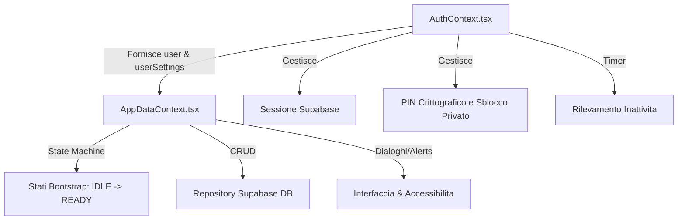

# PLAN 026 — Test Sessione E3 — Contesto Principale e Autenticazione (AuthContext & AppDataContext)

## Riepilogo Esecutivo

Questo Coding Plan definisce la pianificazione strategica per la **Sessione E3** dei test del progetto ZecchinoReact, relativa al **Blocco 2 — Contesti e Hook (Parte 2)**. L'obiettivo è coprire l'intera state machine di bootstrap, i flussi di autenticazione e la complessa logica dello stato centrale dell'applicazione, colmando i gap di copertura rilevati in `docs/1-reports/REPORT-analisi-copertura-test-completa_v1.0.0.md`.

- **Obiettivo della sessione:** Implementare tutti i test mancanti identificati per `AuthContext.tsx` e `AppDataContext.tsx` per garantire la stabilità dei flussi di autenticazione, della persistenza delle impostazioni, della state machine di bootstrap, delle operazioni CRUD e delle integrazioni avanzate (prestiti, rimborsi, notifiche budget, dialoghi).
- **File target con copertura attuale e attesa:**
  - `src/context/AuthContext.tsx` (Copertura attuale: 60.59% → Attesa: >90%)
  - `src/context/AppDataContext.tsx` (Copertura attuale: 50.46% → Attesa: >90%)
- **Conteggio dei test:**
  - **AuthContext.tsx:** 4 test esistenti + 20 test nuovi = 24 test totali.
    `[DISCREPANZA RILEVATA: il report di copertura indica 3 test esistenti e 20 da scrivere, per un totale di 23. Tuttavia, nella sessione di bugfix E0 è stato aggiunto 1 regression test per BUG-4 in __tests__/AuthContext.test.tsx, portando la suite esistente a 4 test (3 PIN + 1 accessibility unmount) e la stima post-sessione a 24 totali.]`
  - **AppDataContext.tsx:** 28 test esistenti + 55 test nuovi = 83 test totali.
  - **Sessione E3 Totale:** 75 test nuovi da scrivere.
- **Suite di destinazione:**
  - `__tests__/AuthContext.test.tsx` [MODIFY]: suite da integrare con i nuovi 20 test di AuthContext (conservando il test esistente per BUG-4).
  - `__tests__/AuthContext.pin.test.tsx` [PREEXISTING]: contiene 3 test PIN esistenti, che **NON** devono essere toccati o modificati.
  - `__tests__/AppDataContext.spec.ts` [MODIFY]: suite da integrare con i nuovi 55 test di AppDataContext.
- **Vincoli tecnici:** Gestione avanzata dei timer fittizi di Jest per testare inattività e avvisi di sessione, mock profondi delle API di Supabase (Auth e tabelle di repository) e conformità al vincolo P29 (persistenza a DB prima dell'aggiornamento locale delle impostazioni).

---

## 1. Contesto Architetturale

### Ruolo dei Moduli nel Ciclo di Vita



- **`AuthContext.tsx`**: È il guardiano della sicurezza e dell'accesso. Gestisce lo stato dell'utente corrente tramite Supabase Auth (`session`, `user`), inizializza le preferenze utente tramite `UserSettingsRepository`, coordina il timer di inattività nativo per bloccare lo schermo privato, e controlla le operazioni crittografiche per la Master Key e l'hash del PIN locale (AES-GCM versionata PBKDF2).
- **`AppDataContext.tsx`**: È il motore centrale dell'applicazione (State Machine a 6 stati: `IDLE | HYDRATING | CACHE-READY | REMOTE-SYNC | READY | ERROR`). Esegue l'idratazione asincrona da cache o database remoto al bootstrap, coordina le transazioni CRUD di conti, transazioni, budget, tag, prestiti, rimborsi, e gestisce gli alert di budget, dialoghi e shortcuts.

### Dipendenze e Relazioni
`AppDataContext.tsx` dipende direttamente da `AuthContext.tsx`:
1. Consuma `user` e `userSettings` da `useAuth()` per configurare la cache locale e autenticare le chiamate remote a Supabase.
2. Un cambio di stato di autenticazione in `AuthContext` (login, logout) innesca l'inquadramento o la distruzione dello stato in `AppDataContext` (tramite `hydrationGen` per prevenire hydration concorrenti).

> [!WARNING]
> **Warning BUG-1 (Fusione Simulazioni Locali al Bootstrap):** 
> Il report E3 identifica il bug critico BUG-1 relativo alla potenziale perdita delle simulazioni locali al bootstrap online. Questo bug è stato corretto formalmente nella Sessione E0. I test in questa sessione devono verificare la corretta persistenza e la stabilità del comportamento di fusione (`mergePrestitiWithLocalSimulations`) senza alterare la logica esistente o introducere modifiche non pianificate.

---

## 2. Dettaglio Modulo per Modulo

### 1. AuthContext.tsx

I nuovi test saranno implementati nel file `__tests__/AuthContext.test.tsx` [MODIFY].
I 3 test PIN preesistenti rimangono separati in `__tests__/AuthContext.pin.test.tsx` e **NON** devono essere modificati.

#### `signIn` e `signUp`
- **`AUTH-01` [Normale]**: `signIn` completa con successo con credenziali valide e aggiorna la sessione utente.
  - *Input*: Email, Password.
  - *Expected*: Supabase Auth chiamato, stato locale `user` aggiornato.
  - *Mock*: `supabase.auth.signInWithPassword` risolve positivamente.
- **`AUTH-02` [Errore]**: `signIn` fallisce su credenziali non valide, propaga l'errore e non aggiorna lo stato.
  - *Input*: Email errata.
  - *Expected*: Propagazione dell'eccezione di errore Supabase.
  - *Mock*: `supabase.auth.signInWithPassword` rigetta con errore.
- **`AUTH-03` [Normale]**: `signUp` esegue correttamente la registrazione con credenziali valide.
  - *Input*: Nuova email, password.
  - *Expected*: Supabase chiamato con successo.
  - *Mock*: `supabase.auth.signUp` risolve positivamente.
- **`AUTH-04` [Errore]**: `signUp` fallisce se l'email esiste già, propagando l'errore.
  - *Input*: Email esistente.
  - *Expected*: Eccezione di errore propagata.
  - *Mock*: `supabase.auth.signUp` rigetta con errore.

#### `signOut`
- **`AUTH-05` [Normale]**: `signOut` rimuove il PIN locale, blocca lo stato privato, esegue il cleanup di cache e storage, ed effettua il logout nativo.
  - *Expected*: `invalidateCache` invocato, `supabase.auth.signOut` eseguito, variabili di PIN locali azzerate.
  - *Mock*: `supabase.auth.signOut` e `invalidateCache` mockati.

#### `resetPassword`
- **`AUTH-06` [Normale]**: `resetPassword` invoca correttamente il servizio Supabase Auth.
  - *Input*: Email.
  - *Expected*: Chiamata a `resetPasswordForEmail` effettuata.
  - *Mock*: `supabase.auth.resetPasswordForEmail` risolve positivamente.
- **`AUTH-07` [Errore]**: `resetPassword` fallisce se l'email non esiste o la rete è assente, propagando l'errore.
  - *Mock*: `supabase.auth.resetPasswordForEmail` rigetta.

#### Timer Inattività e Avviso Sessione
- **`AUTH-08` [Limite]**: Se `timeoutMinutes <= 0`, il timer di inattività non viene configurato né avviato.
  - *Expected*: `showWarning` resta false e nessun timer pianificato.
- **`AUTH-09` [Normale]**: Timer di inattività si esaurisce regolarmente, scatenando la disconnessione automatica (`signOut`).
  - *Expected*: Callback di timeout eseguita, stato privato bloccato e utente disconnesso.
  - *Mock*: `jest.useFakeTimers()`.
- **`AUTH-10` [Normale]**: Raggiungimento del tempo di warning (durata - 1 minuto) imposta `showWarning` a true.
  - *Expected*: Visualizzazione dell'alert di avviso sessione in scadenza.
- **`AUTH-11` [Normale/Limite]**: Clic su "Rimani connesso" reimposta correttamente il timer di inattività ripartendo da zero.
  - *Expected*: Timer resettato, `showWarning` torna a false.

#### Gestione PIN Avanzata
- **`AUTH-12` [Errore]**: `unlockPrivate` con PIN errato fallisce: sblocco bloccato, haptic error invocato, suono di errore riprodotto, e annuncio vocale assertive emesso.
  - *Expected*: `isPrivateUnlocked` resta false, haptic ed audio chiamati.
  - *Mock*: `hapticSystem.pinError`, `soundSystem.play`.
- **`AUTH-13` [Errore]**: `changePin` fallisce se il vecchio PIN inserito non corrisponde all'hash memorizzato.
  - *Expected*: Errore di decifratura, DB non aggiornato.
- **`AUTH-14` [Errore]**: `changePin` fallisce in caso di errore di rete durante il salvataggio dei nuovi parametri Supabase.
  - *Expected*: Stato locale del PIN ripristinato a quello originale.
- **`AUTH-15` [Errore]**: `removePin` fallisce se il PIN inserito per convalida è errato.
  - *Expected*: PIN non rimosso.
- **`AUTH-16` [Normale]**: `removePin` con PIN corretto azzera i tre campi PIN ed esegue `signOut` globale.
  - *Expected*: Chiamata a `updatePinSecurityMaterial` con null, seguita da disconnessione.

#### Casi Limite ed Eventi
- **`AUTH-17` [Errore]**: Fallimento caricamento iniziale di `getOrCreate` (impostazioni utente) sul mount valorizza lo stato di errore.
  - *Mock*: `getOrCreate` rigetta.
- **`AUTH-18` [Normale]**: Mount del provider registra il listener nativo dello screen reader di accessibilità.
  - *Mock*: `AccessibilityInfo.addEventListener` mockato.
- **`AUTH-19` [Normale]**: Unmount del provider pulisce correttamente i listener nativi registrati per evitare leak.
- **`AUTH-20` [Normale/Limite]**: I cambiamenti di stato dello screen reader aggiornano correttamente lo stato locale e innescano le haptic/audio adaptions.

---

### 2. AppDataContext.tsx

I nuovi test saranno integrati nella suite esistente `__tests__/AppDataContext.spec.ts` [MODIFY] (che ha 28 test). I nuovi test utilizzeranno gli ID da `ADC-29` a `ADC-83` per un totale di 55 test.

#### State Machine di Bootstrap (10 test)
- **`ADC-29` [Normale]**: Transizione iniziale dello stato da `IDLE` a `HYDRATING` al mount con utente autenticato.
- **`ADC-30` [Normale]**: Transizione a `READY` con caricamento dati remoti completato con successo (rete online).
- **`ADC-31` [Normale]**: Transizione a `CACHE-READY` quando la rete è offline ma la cache locale è valida e completa.
- **`ADC-32` [Errore]**: Transizione a `ERROR` quando la rete è offline e non è presente alcuna cache locale valida.
- **`ADC-33` [Normale]**: Transizione da `CACHE-READY` a `REMOTE-SYNC` alla riconnessione della rete o invocazione manuale di `refreshAll`.
- **`ADC-34` [Normale]**: Transizione da `REMOTE-SYNC` a `READY` al completamento del recupero dati asincrono da Supabase.
- **`ADC-35` [Normale]**: Transizione da `READY` a `REMOTE-SYNC` quando viene avviato un `refreshAll` manuale.
- **`ADC-36` [Errore]**: Una transizione vietata (es. da `IDLE` a `READY` diretto) viene intercettata, stampando un `console.warn`.
- **`ADC-37` [Errore]**: Una transizione vietata da `ERROR` a `READY` viene bloccata e loggata.
- **`ADC-38` [Limite]**: Cambiamenti rapidi ed out-of-order nello stato di autenticazione mantengono la stabilità dello stato.

#### Gestione della Concorrenza (5 test)
- **`ADC-39` [Limite]**: Il generation counter `hydrationGen` scarta i caricamenti lenti e obsoleti rispetto a hydration più recenti.
- **`ADC-40` [Limite]**: Gestione del doppio mount indotto da React 18 Strict Mode senza duplicazione di sottoscrizioni o hydration concorrenti.
- **`ADC-41` [Limite]**: Sequenza rapida di login/logout cancella immediatamente l'hydration in corso per l'utente precedente.
- **`ADC-42` [Limite]**: Risposte asincrone del DB remoto ricevute dopo un logout vengono scartate (controllo su `hydrationGen`).
- **`ADC-43` [Normale]**: Chiamate multiple a `refreshAll` a distanza ravvicinata vengono limitate per evitare query ridondanti.

#### Hydration della Cache (5 test)
- **`ADC-44` [Normale]**: Hydration offline da cache asincrona carica correttamente tutte le 8 tabelle.
- **`ADC-45` [Errore]**: Mancanza di cache per una singola tabella invalida l'hydration complessiva, portando a `ERROR`.
- **`ADC-46` [Errore]**: Struttura della cache corrotta (es. array mancanti, oggetti invalidi) viene catturata senza mandare in crash l'app.
- **`ADC-47` [Limite]**: Cache vuota su tutte le tabelle ma valida (Caso A) avvia l'app in uno stato pulito senza record.
- **`ADC-48` [Normale]**: Cache stale (scaduta) viene idratata subito as fail-soft, ma innesca immediatamente un refresh remoto in background.

#### Operazioni CRUD e Persistenza (10 test)
- **`ADC-49` [Normale]**: `addAccount` persiste su Supabase Conti e aggiorna lo stato React.
- **`ADC-50` [Normale]**: `updateAccount` aggiorna lo stato e persiste su DB.
- **`ADC-51` [Normale]**: `removeAccount` cancella su DB e aggiorna localmente lo stato.
- **`ADC-52` [Normale]**: `addTransaction` ricalcola i saldi dei conti, persiste ed aggiorna lo stato.
- **`ADC-53` [Normale]**: `updateTransaction` ricalcola i saldi su transazioni modificate e aggiorna il DB.
- **`ADC-54` [Normale]**: `removeTransaction` ricalcola i saldi ed effettua la rimozione a DB.
- **`ADC-55` [Normale]**: Logica CRUD Categoria: aggiunta, modifica ed eliminazione persistono a DB e aggiornano lo stato.
- **`ADC-56` [Normale]**: Logica CRUD Budget: aggiunta, modifica ed eliminazione persistono a DB e aggiornano lo stato.
- **`ADC-57` [Normale]**: Logica CRUD Obiettivi di Risparmio e aggiornamento progressi persistono a DB.
- **`ADC-58` [Normale]**: Logica CRUD Tag: creazione, aggiornamento ed eliminazione fisica del tag persistono a DB.

#### Propagazione dei Tag (5 test)
- **`ADC-59` [Normale]**: `addTagToTransaction` aggiorna la tabella di associazione ed incrementa il contatore `usatoNVolte` del tag.
- **`ADC-60` [Normale]**: `removeTagFromTransaction` rimuove le associazioni e decrementa `usatoNVolte` del tag.
- **`ADC-61` [Normale]**: `setTagsForTransaction` sostituisce le associazioni e adegua i rispettivi contatori di `usatoNVolte`.
- **`ADC-62` [Normale]**: L'eliminazione di una transazione decrementa correttamente `usatoNVolte` di tutti i tag ad essa associati.
- **`ADC-63` [Normale]**: L'eliminazione di un intero conto riduce correttamente `usatoNVolte` dei tag collegati alle transazioni rimosse.

#### Prestiti e Simulazioni (5 test)
- **`ADC-64` [Normale]**: Creazione di un prestito di simulazione locale (con prefisso ID `sim-`) scrive solo in cache locale, non su Supabase DB.
- **`ADC-65` [Normale]**: Modifica di un prestito simulato aggiorna solo lo stato in cache locale.
- **`ADC-66` [Limite]**: Promozione di un prestito da simulazione a contratto attivo: genera un UUID reale, persiste a DB remoto, ed elimina il record con ID `sim-` dalla cache locale.
- **`ADC-67` [Normale]**: Chiusura di un prestito attivo persiste i nuovi flag su Supabase DB.
- **`ADC-68` [Normale]**: Eliminazione di un prestito simulato cancella il record dalla cache locale.

#### Rimborsi Prestiti (5 test)
- **`ADC-69` [Normale]**: Inserimento di un rimborso su un prestito attivo aggiorna il saldo residuo ed il DB.
- **`ADC-70` [Limite]**: Un rimborso che estingue il prestito ne modifica automaticamente lo stato in "chiuso" ed aggiorna il DB.
- **`ADC-71` [Normale]**: Cancellazione di un rimborso ricalcola il saldo residuo incrementandolo e persiste a DB.
- **`ADC-72` [Errore]**: Il tentativo di inserire un rimborso su un prestito di simulazione viene bloccato, sollevando un errore.
- **`ADC-73` [Errore]**: Il tentativo di eliminare un rimborso su una simulazione viene respinto.

#### Gestione Form e Dialoghi (5 test)
- **`ADC-74` [Normale]**: Apertura di un dialogo imposta `activeDialog` e popola i campi con lo stato del record selezionato.
- **`ADC-75` [Normale]**: Chiusura di un dialogo resetta lo stato dei form ed azzera `activeDialog`.
- **`ADC-76` [Normale]**: Le scorciatoie da tastiera (Escape per chiudere, Invio per confermare) attivano le corrette callback di dialogo.
- **`ADC-77` [Normale]**: La scorciatoia da tastiera per l'export dei dati richiama correttamente `handleExportCSV`.
- **`ADC-78` [Normale]**: Le modifiche temporanee nei campi del form del dialogo rimangono confinate nello stato locale del form.

#### Esiti di Export CSV (2 test)
- **`ADC-79` [Normale]**: `handleExportCSV` con esito positivo: annuncio vocale di successo emesso e feedback tattile di successo avviato.
  - *Mock*: `exportFile` restituisce `{ success: true }`.
- **`ADC-80` [Errore]**: `handleExportCSV` con fallimento (es. `PERMISSION_DENIED`, `FILESYSTEM_ERROR`): visualizzazione toast di errore specifico ed emissione annuncio vocale di errore appropriato.
  - *Mock*: `exportFile` restituisce `{ success: false, reason: 'PERMISSION_DENIED' }`.

#### Budget Alerts (3 test)
- **`ADC-81` [Normale]**: Transazione che porta la spesa di un budget al 75% attiva un alert di livello "warning" (toast, suono di avviso, haptic warning).
  - *Mock*: `shouldShowBudgetNotification` restituisce `{ shouldShow: true, level: 'warning' }`.
- **`ADC-82` [Normale]**: Spesa che supera il 90% attiva un alert di livello "critical" (toast, suono critico, haptic critical).
  - *Mock*: `{ shouldShow: true, level: 'critical' }`.
- **`ADC-83` [Normale]**: Spesa che supera il 100% attiva un alert "exceeded" (toast di sforamento, suono forte, haptic exceeded).

---

## 3. Strategia di Mock

### Mock per AuthContext
| Modulo da mockare | Strategia | Scopo nei Test |
|---|---|---|
| `@/lib/supabase/client` | `jest.mock` | Simulare i metodi di autenticazione di Supabase Auth (`signInWithPassword`, `signUp`, `signOut`, `resetPasswordForEmail`). |
| `@/lib/supabase/repositories/impostazioni-utente` | `jest.mock` | Mockare `getOrCreate`, `updatePinSecurityMaterial`, `updatePreference` per testare persistenza. |
| `@/lib/crypto` | `jest.mock` / imports reali | Fornire implementazioni stabili di hashing PIN e wrap/unwrap per non rallentare i test con PBKDF2 reali. |
| `@/lib/sound-system` | `jest.mock` | Intercettare e verificare le riproduzioni sonore in caso di errore PIN. |
| `@/lib/haptic-system` | `jest.mock` | Intercettare e verificare le vibrazioni al fallimento del PIN. |
| `@/announcements` | `jest.mock` | Verificare la corretta emissione di annunci screen reader (assertive/polite) per sblocchi ed errori. |
| `react-native` (Platform / AccessibilityInfo) | `jest.mock` | Simulare eventi dello screen reader ed adattamenti di piattaforma. |

### Mock per AppDataContext
| Modulo da mockare | Strategia | Scopo nei Test |
|---|---|---|
| Repository di Supabase (Conti, Transazioni, Tag, Ricorrenze, Prestiti, Rimborsi) | `jest.mock` | Mockare tutti i metodi `getAll`, `create`, `update`, `remove` per simulare risposte DB. |
| `@/lib/supabase/cache` | `jest.mock` | Mockare `readCache`, `writeCache`, `isCacheStale` per simulare hydration offline e fallimenti. |
| `@/lib/export-service` | `jest.mock` | Simulare gli esiti asincroni di export per testare i toast ed annunci. |
| `@/lib/sound-system` | `jest.mock` | Rilevare la riproduzione sonora delle notifiche budget. |
| `@/lib/haptic-system` | `jest.mock` | Rilevare le vibrazioni generate per budget ed export. |
| `react-native` (Platform) | `jest.mock` | Abilitare i test specifici per tastiera Windows in `ActivityDetectorView` ed export. |

### Gestione dei Fake Timers (Regola NT-2)
Per garantire che i test di inattività di `AuthContext` e la state machine non interferiscano con altre suite:
1. Inizializzare i fake timer in `beforeEach`:
   ```typescript
   jest.useFakeTimers();
   ```
2. Avanzare il tempo controllando le scadenze:
   ```typescript
   jest.advanceTimersByTime(ms);
   ```
3. Ripristinare lo stato dei timer reali in `afterEach`:
   ```typescript
   jest.runOnlyPendingTimers();
   jest.useRealTimers();
   ```

---

## 4. Ordine dei Commit e Flusso di Esecuzione Consigliato

Si richiede di strutturare lo sviluppo dei test nei seguenti 5 commit atomici eseguiti direttamente su `main`:

### Commit 1: `test: completa copertura dei flussi principali di AuthContext`
- **Moduli coinvolti:** `src/context/AuthContext.tsx` (AUTH-01..AUTH-11)
- **File di test modificati:** `__tests__/AuthContext.test.tsx` [MODIFY]
- **Numero test:** 11 test nuovi.
- **Verifica locale:** `npx jest __tests__/AuthContext.test.tsx`

### Commit 2: `test: completa copertura dei flussi PIN e screen reader in AuthContext`
- **Moduli coinvolti:** `src/context/AuthContext.tsx` (AUTH-12..AUTH-20)
- **File di test modificati:** `__tests__/AuthContext.test.tsx` [MODIFY]
- **Numero test:** 9 test nuovi.
- **Verifica locale:** `npx jest __tests__/AuthContext.test.tsx`

### Commit 3: `test: aggiunge test per la state machine di AppDataContext`
- **Moduli coinvolti:** `src/context/AppDataContext.tsx` (Bootstrap, Concorrenza, Cache, CRUD Conti/Movimenti parziali)
- **File modificati:** `__tests__/AppDataContext.spec.ts` [MODIFY]
- **Numero test:** 25 test nuovi (ADC-29..ADC-53).
- **Verifica locale:** `npx jest __tests__/AppDataContext.spec.ts`

### Commit 4: `test: implementa test per le azioni CRUD e prestiti in AppDataContext`
- **Moduli coinvolti:** `src/context/AppDataContext.tsx` (CRUD Transazioni/Tag/Categorie/Budget/Obiettivi, Mapping Tag, Prestiti e Rimborsi)
- **File modificati:** `__tests__/AppDataContext.spec.ts` [MODIFY]
- **Numero test:** 20 test nuovi (ADC-54..ADC-73).
- **Verifica locale:** `npx jest __tests__/AppDataContext.spec.ts`

### Commit 5: `test: aggiunge test per dialoghi, export e alert in AppDataContext`
- **Moduli coinvolti:** `src/context/AppDataContext.tsx` (Dialoghi, Shortcuts, Export CSV, Budget Alerts)
- **File modificati:** `__tests__/AppDataContext.spec.ts` [MODIFY]
- **Numero test:** 10 test nuovi (ADC-74..ADC-83).
- **Verifica locale:** `npx jest __tests__/AppDataContext.spec.ts`

---

## 5. Protocollo di Validazione

La validazione deve seguire i criteri di correttezza formale e stabilità:

### Comandi di Verifica
1. **Jest Test suite:**
   ```bash
   npx jest --testPathPattern="AuthContext|AppDataContext"
   ```
2. **TypeScript compilation check:**
   ```bash
   npx tsc --noEmit
   ```

### Criteri di Accettazione
- **Ciclo A (Revisione Tecnica):**
  - Tutti i test in `AuthContext.test.tsx` e `AppDataContext.spec.ts` devono risultare verdi (PASS).
  - Nessun test preesistente (inclusi i 3 PIN in `AuthContext.pin.test.tsx` e i 28 in `AppDataContext.spec.ts`) deve risultare rotto.
  - La compilazione TypeScript non deve produrre alcun errore.
  - Limite tentativi: max 10. In caso di fallimento prolungato, presentare un **Diagnostic Report**.

- **Ciclo B (Revisione Qualitativa):**
  - Assenza di falsi positivi (i test devono asserire i comportamenti attesi reali, non semplici mock vuoti).
  - Isolamento dei test: l'uso dei timers fittizi deve essere ripulito rigorosamente tramite `afterEach`.
  - Conformità al vincolo P29 (il cambiamento dello stato React locale avviene solo a seguito di conferma Supabase).

---

## 6. Metriche Attese al Completamento

| Metrica | Pre-E3 | Post-E3 (Target) |
|---|---|---|
| **Test totali in suite AuthContext** | 4 | 24 |
| **Test totali in suite AppDataContext** | 28 | 83 |
| **Copertura percentuale AuthContext.tsx** | 60.59% | > 90.00% |
| **Copertura percentuale AppDataContext.tsx** | 50.46% | > 90.00% |
| **Copertura globale file core coinvolti** | ~55% | > 92% |

---

## Note Tecniche Critiche

### NT-1 — Vincolo P29 (Scrittura Non Ottimistica)
Nei test CRUD o di aggiornamento delle preferenze (es. `addAccount`, `setAudioEnabled`), verificare che lo stato locale non muti finché il repository Supabase non ha risolto la promessa. Se la chiamata Supabase fallisce (rigetta), lo stato non deve aggiornarsi e l'errore deve essere registrato in locale.

### NT-2 — Ricalcolo Saldi
I test CRUD per le transazioni (`ADC-52`, `ADC-53`, `ADC-54`) devono asserire il corretto ricalcolo dinamico del saldo dei conti interessati per importi positivi (entrate) e negativi (uscite).

### NT-3 — Mappatura ID Simulazione (`sim-`)
I test sui prestiti (`ADC-64`..`ADC-68`) devono verificare che i record locali con ID simulato non inneschino chiamate remote al database Supabase durante le operazioni di salvataggio finché non vengono promossi a contratti attivi tramite la transizione formale di UUID.
